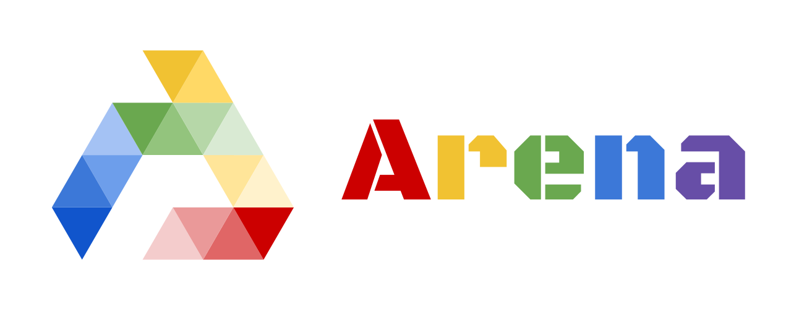

## Introduction


<!-- |   |   |   |  |   |
| ------------- | ------------- | ------------- | ------------- | ------------- |
|   |   |   |  |  |

|   |   |   |  |   |
| ------------- | ------------- | ------------- | ------------- | ------------- |
|   |   |   |  |  | -->


[Arena](https://sites.google.com/view/arena-unity/) is a general evaluation platform and building toolkit for single/multi-agent intelligence.
As a part of [Arena](https://sites.google.com/view/arena-unity/) project, this repository is to provide implementation of state-of-the-art deep multi-agent reinforcement learning baselines.
Arena-Baselines is fully based on [RLlib](https://ray.readthedocs.io/en/latest/rllib.html).
More resources can be found in [Arena Home](https://sites.google.com/view/arena-unity/).
If you use this repository to conduct research, we kindly ask that you [cite the paper](#citation) as a reference.

## Status: Release

We are currently open to any suggestions or pull requests from the community to make Arena a better platform.
To contribute to the project, [joint us in  Slack](https://join.slack.com/t/arena-ml/shared_invite/enQtNjc1NDE1MTY0MjU3LWMxMjZiMTYyNTE3OWIzM2QxZjU5YmI1NTM2YzYzZDZlNjY0NzllMDFlMjA3MGZiN2QxODA1NTJhZDkzOTI3Nzg), and check [To Do list in Trello](https://trello.com/b/zDiljShz).

Part of the project is maintained in a [separated internal repo](https://github.com/YuhangSong/Arena-Baselines-Internal), where we are working on features including:
*
contact us via slack if you want to have access to these features.

## Get Started

### Dependencies

* [RLlib: Scalable Reinforcement Learning](https://ray.readthedocs.io/en/latest/rllib.html)
* [gym_unity](https://github.com/Unity-Technologies/ml-agents/tree/master/gym-unity)

To install above dependencies, run: (following commands could be outdated, if so, go to each link above)
```bash
# Only for users behind the Great Wall of China, no need for other users
conda config --add channels https://mirrors.tuna.tsinghua.edu.cn/anaconda/pkgs/free/
conda config --add channels https://mirrors.tuna.tsinghua.edu.cn/anaconda/pkgs/main/
conda config --set show_channel_urls yes
pip install pip -U
pip config set global.index-url https://pypi.tuna.tsinghua.edu.cn/simple

# Create a virtual environment
conda create -n Arena python=3.6.7 -y
source activate Arena

# Clone code
mkdir Arena
cd Arena
git clone https://github.com/YuhangSong/Arena-Baselines.git
cd Arena-Baselines

# PyTorch
pip install --upgrade torch torchvision

# TensorFlow
pip install --upgrade tensorflow-gpu

# Other requirements
pip install -r requirements.txt
```

If you run into following situations,

* You are running on a remote server without GUI (X-Server).
* Your machine have a X-Server but it does not belongs (started by) your account, so you cannot access it. (If your machine have a X-Server but it belongs (started by) your account, but you cannot use the GUI desktop all the time, see [here](https://github.com/YuhangSong/Arena-Baselines/x-server-belongs-to-you.md))

If none of above is your situation, i.e., you are running things on your own desktop, skip this part and go to [Usage](#Usage).
If you are in above situations, follow guidelines [here](https://github.com/Unity-Technologies/ml-agents/blob/master/docs/Training-on-Amazon-Web-Service.md) to setup a virtual display.
Or you can follow [here](https://github.com/YuhangSong/Arena-Baselines/set-up-x-server.md) (This is simpler and get you in place in shorter time, but could be outdated. If so, go to the above link, and consider open a pull requests to give a update of this).

## Usage

Crate TMUX session (if the machine is a server you connect via SSH), and enter virtual environment
```
tmux new-session -s Arena
source activate Arena
```

### Continuous Action Space

#### Baseline: Self-Play

Games:
* ArenaCrawler-Example-v2-Continuous
* ArenaCrawlerMove-2T1P-v1-Continuous
* ArenaCrawlerRush-2T1P-v1-Continuous
* ArenaCrawlerPush-2T1P-v1-Continuous
* ArenaWalkerMove-2T1P-v1-Continuous
* Crossroads-2T1P-v1-Continuous
* Crossroads-2T2P-v1-Continuous
* ArenaCrawlerPush-2T2P-v1-Continuous
* RunToGoal-2T1P-v1-Continuous
* Sumo-2T1P-v1-Continuous
* YouShallNotPass-Dense-2T1P-v1-Continuous

Commands, replace GAME_NAME with above games:
```
```

### Discrete Action Space

#### Baseline: Self-Play

Games:
* Crossroads-2T1P-v1-Discrete
* FighterNoTurn-2T1P-v1-Discrete
* FighterFull-2T1P-v1-Discrete
* Soccer-2T1P-v1-Discrete
* BlowBlow-2T1P-v1-Discrete
* Boomer-2T1P-v1-Discrete
* Gunner-2T1P-v1-Discrete
* Maze3x3Gunner-PenalizeTie-2T1P-v1-Discrete
* Maze3x3Gunner-PenalizeTie-2T1P-v2-Discrete
* Barrier4x4Gunner-2T1P-v1-Discrete
* Soccer-2T2P-v1-Discrete
* BlowBlow-2T2P-v1-Discrete
* BlowBlow-Dense-2T2P-v1-Discrete
* Tennis-2T1P-v1-Discrete
* Tank-FP-2T1P-v1-Discrete
* BlowBlow-Dense-2T1P-v1-Discrete

We also support traditional Atari games, such as:
* PongNoFrameskip-v4
* BreakoutNoFrameskip-v4

Commands, replace GAME_NAME with above games:

```
```
