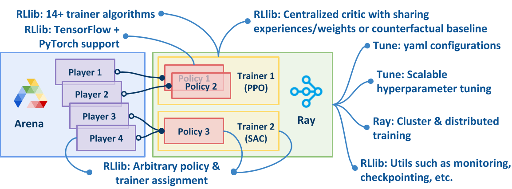
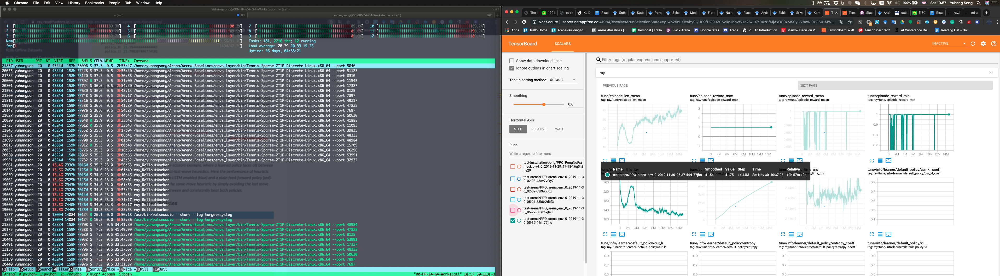
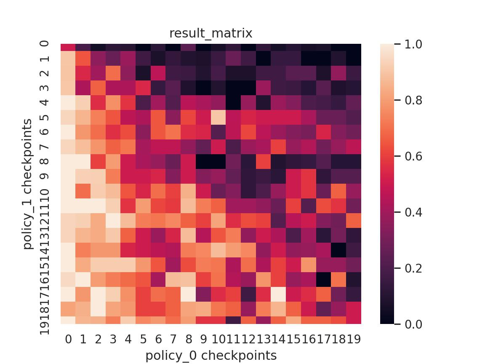

# Arena-Baselines


[Arena](https://sites.google.com/view/arena-unity/) is a general evaluation platform and building toolkit for single/multi-agent intelligence.
As a part of [Arena](https://sites.google.com/view/arena-unity/) project, this repository is to provide implementation of state-of-the-art deep single/multi-agent reinforcement learning baselines.
Arena-Baselines is based on [ray](https://github.com/ray-project/ray).
Other resources can be found in [Arena Home](https://sites.google.com/view/arena-unity/).
If you use this repository to conduct research, we kindly ask that you [cite the papers](#citation) as references.

## Features

Arena-Baselines is built upon [ray](https://github.com/ray-project/ray), benefiting from lots of handy features from it as well as bringing some further advantages.



### Baselines

10+ most popular deep single/multi-agent reinforcement learning baselines, including: independent learners, self-play, variable-shared policies (share arbitrary variables/layers), centralized critic via experiences sharing, centralized critic via observations sharing, Q-Mix, arbitrary grouping agents, centralized critic with counterfactual baselines, population-based training, and etc.

| **Baselines** | **Supported**(:heavy_check_mark:) / **In-progress**(:heavy_minus_sign:) |
| - | -  |
| Independent Learners | :heavy_check_mark: |
| Self-play | :heavy_check_mark: |
| Population-based Training | :heavy_check_mark: |
| Share Weights: between Arbitrary Agents / Teams | :heavy_check_mark: |
| Sharing observations: own, team_absolute, team_relative, all_absolute, all_relative | :heavy_check_mark: |
| Multiple sensors: first-person visual, third-person visual, vector (lidar), or any combinations | :heavy_check_mark: |
| Use separated observations for actor and critic (such as centralized critic and decentralized actors). | :heavy_check_mark: |

### Games

30+ games built by [Arena-BuildingToolkit](https://github.com/YuhangSong/Arena-BuildingToolkit), including Tennis, Tank, BlowBlow, FallFlat, and etc.
There are also multiple variants of each game with different team setups, social structures, actions spaces, observation spaces (first-person visual, third-person visual, vector or mixed), domain randomizations, and etc.
More documentation of games can be found in [Arena-Benchmark](https://github.com/YuhangSong/Arena-Benchmark)

### Utilities

Many research-oriented utilities, such as:

| **Utilities** | **Supported**(:heavy_check_mark:) / **In-progress**(:heavy_minus_sign:) |
| - | - |
| Tune (grid search parameters, schedule trails, yaml config and etc.) | :heavy_check_mark: |
| Interactively load and evaluate trained policies/populations | :heavy_check_mark: |
| Visualize performance in population | :heavy_check_mark: |

## Status: Release

We are currently open to any suggestions or pull requests from the community to make Arena better.
To contribute to the project, [joint us in  Slack](https://join.slack.com/t/arena-ml/shared_invite/enQtNjc1NDE1MTY0MjU3LWMxMjZiMTYyNTE3OWIzM2QxZjU5YmI1NTM2YzYzZDZlNjY0NzllMDFlMjA3MGZiN2QxODA1NTJhZDkzOTI3Nzg), check [To Do list in Trello](https://trello.com/b/zDiljShz) as well as check [issues](https://github.com/YuhangSong/Arena-Baselines/issues) opened in the repo.

We are re-benchmarking all games, currently, all games are available in [Arena-BuildingToolkit](https://github.com/YuhangSong/Arena-BuildingToolkit).
We are building and testing them one by one.
You can build and test it yourself if you urgently want to try some the games (we have played with the games and they are fine, it's just we have not have enough resources to train them yet).
Before you build a game and train it, you can also play with it in [Arena-BuildingToolkit](https://github.com/YuhangSong/Arena-BuildingToolkit) so that you can make sure you are satisfied with the game.
The env examples you are seeing in the ```arena-experiments/Arena-Benchmark.yaml``` are the ones we have built and trained.

## Table of Contents

<!-- TOC depthFrom:1 depthTo:6 withLinks:1 updateOnSave:1 orderedList:0 -->

- [Arena-Baselines](#arena-baselines)
	- [Features](#features)
		- [Baselines](#baselines)
		- [Games](#games)
		- [Utilities](#utilities)
	- [Status: Release](#status-release)
	- [Table of Contents](#table-of-contents)
	- [Get Started](#get-started)
		- [Dependencies](#dependencies)
	- [Usage](#usage)
		- [Run tests](#run-tests)
		- [Reproduce Arena-Benchmark](#reproduce-arena-benchmark)
		- [Visualization](#visualization)
		- [Evaluate and Visualize Evaluation](#evaluate-and-visualize-evaluation)
		- [Run in Dummy Mode for Debugging](#run-in-dummy-mode-for-debugging)
		- [Resume Training](#resume-training)
		- [Register New Games](#register-new-games)
	- [Configs](#configs)
	- [Common Problems](#common-problems)
		- [Game threads still running](#game-threads-still-running)
	- [Citation](#citation)
	- [License](#license)
	- [Acknowledgement](#acknowledgement)

<!-- /TOC -->

## Get Started

### Dependencies

To install above dependencies, run: (we are using specific versions of the dependencies)
```bash
# In case you have not install these basic staff
sudo apt-get install htop python-pip ffmpeg git -y
wget https://repo.anaconda.com/archive/Anaconda3-2019.10-Linux-x86_64.sh
bash Anaconda3-2019.10-Linux-x86_64.sh

# My personal config for new machines, skip this is you do not understand the following command
git config --global user.email "YuhangSong.China@gmail.com"
git config --global user.name "YuhangSong"
git config --global push.default "current"
git config --global pull.default "current"
git config --global credential.helper "cache --timeout=36000000000000000"

# Set conda source. Only for users behind the Great Wall of China, no need for other users
conda config --add channels https://mirrors.tuna.tsinghua.edu.cn/anaconda/pkgs/free/
conda config --add channels https://mirrors.tuna.tsinghua.edu.cn/anaconda/pkgs/main/
conda config --set show_channel_urls yes
# If you accidentally did above, type: vim ~/.condarc, and reset conda source by removing the first two lines. Finally, run: conda update --all

# Set pip source. Only for users behind the Great Wall of China, no need for other users.
pip config set global.index-url https://pypi.tuna.tsinghua.edu.cn/simple
# If you accidentally did above, reset pip source with: pip config set global.index-url https://pypi.org/simple

# Create dir
mkdir Arena
cd Arena

# clone code
git clone https://github.com/YuhangSong/Arena-Baselines.git
cd Arena-Baselines

# Create a virtual environment
conda deactivate
conda remove --name Arena-Baselines --all -y
conda create -n Arena-Baselines python=3.6.9 -y
conda activate Arena-Baselines

# Install required packages
pip3 install -r requirements.txt
# There will be error messages when excuting this, simply ignore this

```

If you are using different versions of ray or tensorflow, finish [run tests](##run-tests) to make sure it works.
Open up a pull request if you find newer versions that also works fine to complete the tests.

If you run into following situations,

* You are running on a remote server without GUI (X-Server).
* Your machine have a X-Server but it does not belongs (started by) your account, so you cannot access it. (If your machine have a X-Server but it belongs (started by) your account, but you cannot use the GUI desktop all the time, see [here](https://github.com/YuhangSong/Arena-Baselines/blob/master/x-server-belongs-to-you.md))

If none of above is your situation, i.e., you are running things on your own desktop, skip this part and go to [Usage](#Usage).
If you are in above situations, follow guidelines [here](https://github.com/Unity-Technologies/ml-agents/blob/master/docs/Training-on-Amazon-Web-Service.md) to setup a virtual display.
Or you can follow [here](https://github.com/YuhangSong/Arena-Baselines/blob/master/set-up-x-server.md) (This is simpler and get you in place in shorter time, but could be outdated. If so, go to the above link, and consider open a pull requests to give a update of this).

## Usage

First, crate a TMUX session to maintain your process (more necessary if the machine is a server you connect via SSH), and enter virtual environment
```
tmux new-session -s Arena
source activate Arena-Baselines
```

### Run tests

Test your installation of rllib learning environment with Pong (rllib breaks sometimes, so a test is needed before you go further).
In ```./arena-experiments/Arena-Benchmark.yaml```, comment out other envs and leave ```PongNoFrameskip-v4``` there. Then, run:
```
python train.py -f ./arena-experiments/Arena-Benchmark.yaml
```
You should see reward goes up from -21 (as shown in the following), which means you installation works fine.


Meet some problems? Open an issue.

Now, recover ```./arena-experiments/Arena-Benchmark.yaml``` you just modified.
Test an Arena environment (Arena could have difficulties lunching due to different reasons, so a test is needed before you go further)
```
python test_arena_rllib_env.py -f ./arena-experiments/Arena-Benchmark.yaml
```
You should see prints like following:
```
INFO:__main__:obs_rllib: {'agent_0': array([0.41156876, ... , 0.23122263]), 'agent_1': array([0.41156882, ... , 0.23122263])}
INFO:__main__:rewards_rllib: {'agent_0': 0.0, 'agent_1': 1.0}
INFO:__main__:dones_rllib: {'agent_0': True, 'agent_1': True, '__all__': True}
INFO:__main__:infos_rllib: {'agent_0': {'text_observation': ['', ''], 'brain_info': <mlagents.envs.brain.BrainInfo object at 0x7f179da92780>, 'shift': 1}, 'agent_1': {'text_observation': ['', ''], 'brain_info': <mlagents.envs.brain.BrainInfo object at 0x7f179da92780>, 'shift': 1}}
episode end, keep going?
```
Hit enter and it keeps rolling.
Meet some problems? Open an issue.

### Reproduce Arena-Benchmark

Now train on Arena games (reproduce our Arena-Benchmark) with:
```
python train.py -f ./arena-experiments/Arena-Benchmark.yaml
```

### Visualization

The code log multiple curves (as well as figures and other formats of data) to help analysis the training process, run:
```
source activate Arena-Baselines && tensorboard --logdir=~/Arena-Benchmark --port=9999
```
and visit ```http://localhost:9999``` for visualization with tensorboard.

If your port is blocked, use [natapp](https://natapp.cn/) to forward a port:
```
./natapp --authtoken 237e94b5d173a7c3
```
Above token is a free port used by myself, please apply a free port (or buy a faster one) yourself on [natapp](https://natapp.cn/) so that you can enjoy the best experience.

You should see the ```episode_len_mean``` goes up from 20 (as shown in the following), which means you installation works fine.



Our established benchmark can be found in [Arena-Benchmark](https://github.com/YuhangSong/Arena-Benchmark).

### Evaluate and Visualize Evaluation

Append ```--eval``` argument.
In evaluation mode, the programe will detect the logdirs you have locally on your computer as well as detect the populations and iterations you have in each logdir.
Then a series of questions will be promoted for you to make a selection of which checkpoint(s) you want to load for each agent.
After this, you will have selected a list of ```checkpoint_paths``` for each agent, then the programe will run each of the possible combinations, thus, you will see print like the following:

**Note about ```agent``` and ```policy```**: ```agent``` is the concept in environment, and ```policy``` is the corresponding concept on the learning side. In Arena-Baselines, the mapping between the two is one-to-one, though you can share weights between policies (equals to the case where two agents is controlled by just one policy).

```
============================= sampling... =============================
policy_loading_status:
{ 'policy_0': { 'checkpoint_path': '...size_population=1_2020-02-07_17-01-35stfrwt58/learning_agent/p_0-i_1',
                'checkpoint_path_i': 0},
  'policy_1': { 'checkpoint_path': '...size_population=1_2020-02-07_17-01-35stfrwt58/learning_agent/p_0-i_2',
                'checkpoint_path_i': 1}}
results:
{ 'policy_0': { 'episode_lengths_max': 24,
                'episode_lengths_mean': 15.428571428571429,
                'episode_lengths_min': 14,
                'episode_rewards_max': 1.0,
                'episode_rewards_mean': 0.71428573,
                'episode_rewards_min': 0.0},
  'policy_1': { 'episode_lengths_max': 24,
                'episode_lengths_mean': 15.428571428571429,
                'episode_lengths_min': 14,
                'episode_rewards_max': 1.0,
                'episode_rewards_mean': 0.2857143,
                'episode_rewards_min': 0.0}}
============================= sampling... =============================
policy_loading_status:
{ 'policy_0': { 'checkpoint_path': '...size_population=1_2020-02-07_17-01-35stfrwt58/learning_agent/p_0-i_1',
                'checkpoint_path_i': 0},
  'policy_1': { 'checkpoint_path': '...size_population=1_2020-02-07_17-01-35stfrwt58/learning_agent/p_0-i_3',
                'checkpoint_path_i': 2}}
summarization:
{ 'policy_0': { 'episode_lengths_max': 32,
                'episode_lengths_mean': 17.0,
                'episode_lengths_min': 14,
                'episode_rewards_max': 1.0,
                'episode_rewards_mean': 0.33333334,
                'episode_rewards_min': 0.0},
  'policy_1': { 'episode_lengths_max': 32,
                'episode_lengths_mean': 17.0,
                'episode_lengths_min': 14,
                'episode_rewards_max': 1.0,
                'episode_rewards_mean': 0.6666667,
                'episode_rewards_min': 0.0}}
```
where ```policy_loading_status``` tells you which checkpoint is loaded to each policy, and ```summarization``` tells you the episode statistic of each policy when loading policies according to ```policy_loading_status```.
The above results will be recorded in a single matrix called ```result_matrix```.
```result_matrix``` is nested list with the shape of:
```
(
    len(checkpoint_paths[policy_ids[0]]),
    len(checkpoint_paths[policy_ids[1]]),
    ...,
    len(policy_ids)
)
```
Example: value at ```result_matrix[a,b,c]``` means
when load ```policy_0``` with ```checkpoint_paths[policy_ids[0]][a]```
and load ```policy_1``` with ```checkpoint_paths[policy_ids[1]][b]```, the episode_rewards_mean of ```policy_c```.

Then, we will try to visualize ```result_matrix```, see ```vis_result_matrix``` in ```./arena/vis.py```.
For examle, for 2TxP games, you will get a visualization as following:

which shows how each match goes.
Specifically, policy at later iterations beat those at earlier iterations, policies at similar iterations produce a tie, and etc.

You can, of course, compare your policies against our established [Arena-Benchmark](https://github.com/YuhangSong/Arena-Benchmark).

### Run in Dummy Mode for Debugging

Append ```--dummy``` argument to the end of the command, which will try to run the experiments with minimal request of resources. This is for the convenience of debugging.

### Resume Training

To resume/restore a training, append ```--resume``` to the above command in [Reproduce Arena-Benchmark](##reproduce-arena-benchmark)

### Register New Games

To register a new game, append the ID of the game to ```env_ids``` in ```./arena/__init__.py```.
Note that the ID of a game is slightly different from the file name of a game, see [Common Naming Rules](https://github.com/YuhangSong/Arena-Benchmark/blob/master/README.md#common-naming-rules).

## Configs

Function ```create_parser``` in ```./train.py``` gives the detailed description of the configs.
Read them to understand the configs.
Note that we do not recommend passing configs via argparse, instead, use yaml file to config you experiment, as what has been done in [run tests](##run-tests).
In this way, you can make sure your experiments are reproducable.

## Common Problems

#### Game threads still running

Sometimes, the game threads do not exit properly after you kill the python thread.
Run following command to print a banch of kill commmands.
Then run the printed commands to kill all the game threads.
```
ps aux | grep -ie Linux.x86_64 | awk '{print "kill -9 " $2}'
```

## Citation

If you use Arena to conduct research, we ask that you cite the following paper as a reference:
```
@inproceedings{song2020arena,
  title={Arena: A General Evaluation Platform and Building Toolkit for Multi-Agent Intelligence.},
  author={Song, Yuhang and Wojcicki, Andrzej and Lukasiewicz, Thomas and Wang, Jianyi and Aryan, Abi and Xu, Zhenghua and Xu, Mai and Ding, Zihan and Wu, Lianlong},
  booktitle={AAAI},
  pages={7253--7260},
  year={2020}
}
```
as well as the engine behind Arena, without which the platform would be impossible to create
```
@article{juliani2018unity,
  title={Unity: A general platform for intelligent agents},
  author={Juliani, Arthur and Berges, Vincent-Pierre and Vckay, Esh and Gao, Yuan and Henry, Hunter and Mattar, Marwan and Lange, Danny},
  journal={arXiv preprint arXiv:1809.02627},
  year={2018}
}
```

## Contribute

### TODOs

- Upgrade ml-agent and ray to recent versions

## License

[Apache License 2.0](LICENSE)

## Acknowledgement

We give special thanks to the [Whiteson Research Lab](http://whirl.cs.ox.ac.uk/) and [Unity ML-Agents Team](https://unity3d.com/machine-learning/), with which the discussion shaped the vision of the project a lot.
